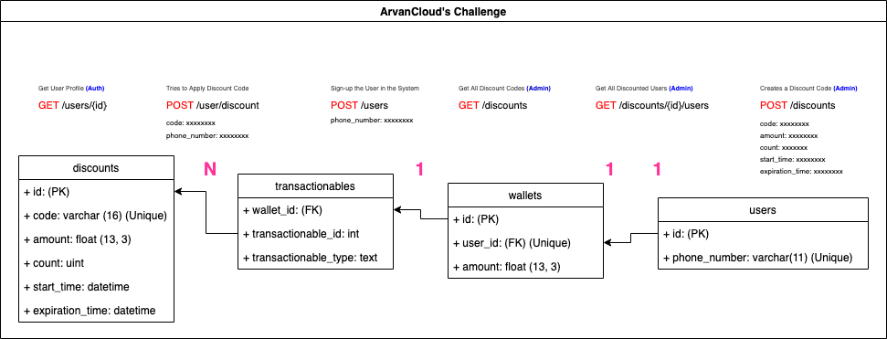

# ArvanCloud's Interview Challenge
You can See the Full Description in [This Link](.github/assets/description.pdf)

Run the following instructions to setup the project:

```bash

docker run --rm --interactive --tty --volume $PWD:/app composer:2.0 install --ignore-platform-reqs
./vendor/bin/sail up -d
./vendor/bin/sail artisan migrate
./vendor/bin/sail composer docgen

```

Finally in your browser open `http://localhost/docs` to see the Full Documentation 


---

# System Analyze
